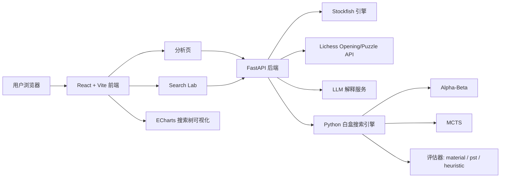
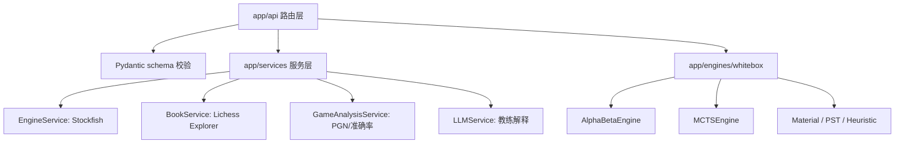
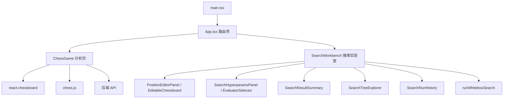
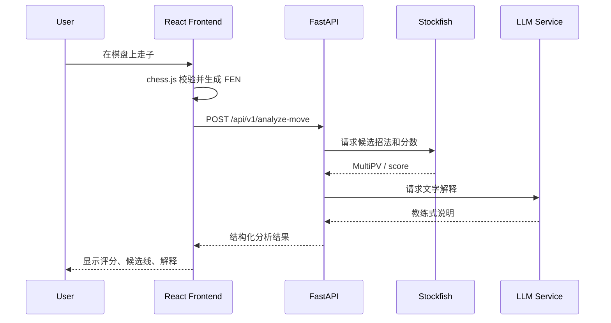
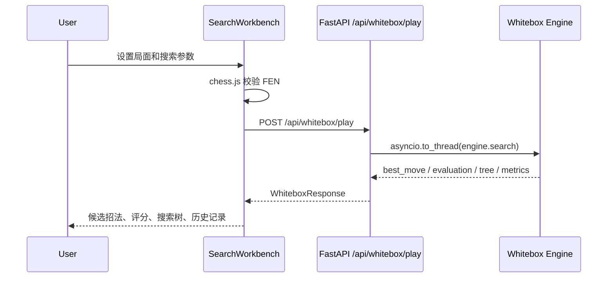
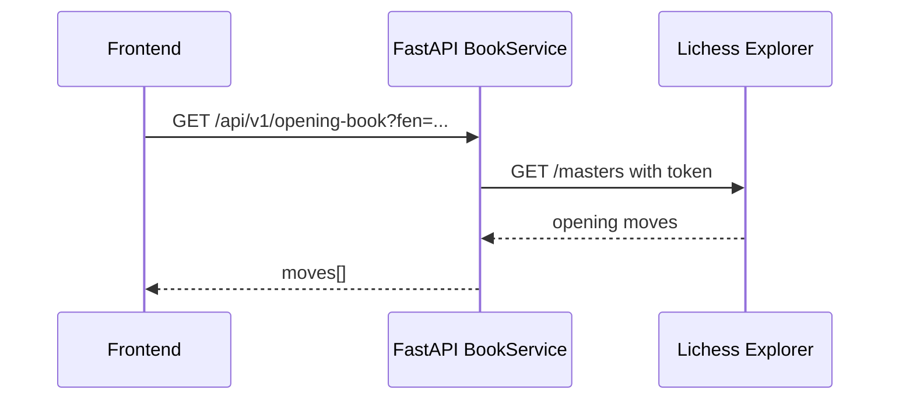

# ChessExplain 技术路线说明

本文档说明 ChessExplain 的技术路线、开源项目借鉴关系、整体架构、模块职责、数据流和部署串联方式。

## 1. 项目定位

ChessExplain 是一个“国际象棋分析 + 白盒搜索实验”平台。它不是单纯的对弈网站，而是把以下三类能力组合在一起：

- **实战分析**：基于 Stockfish 评估当前局面、候选招法和整盘 PGN。
- **开局库辅助**：调用 Lichess Opening Explorer 获取大师棋谱中的开局选择。
- **白盒搜索实验室**：可视化 Alpha-Beta 剪枝和 MCTS 的搜索过程、候选招法、节点统计和搜索树。

当前活跃代码集中在 `phase2_research/`。根目录保留项目级 README、部署配置、文档和 agent 工作说明。

## 2. 开源项目与 GitHub 借鉴

本项目没有发现“直接 fork 某个 GitHub 仓库”的证据。更准确的描述是：

> 业务逻辑和页面组织是自研的，棋盘渲染、走法规则、引擎接口、图表渲染等基础能力借鉴并复用了成熟开源项目。

### 2.1 直接依赖或核心复用

| 项目 | GitHub / 来源 | 在本项目中的作用 |
| --- | --- | --- |
| `react-chessboard` | [Clariity/react-chessboard](https://github.com/Clariity/react-chessboard) | 前端棋盘组件，用于分析页棋盘和 Search Lab 可视化摆子。 |
| `chess.js` | [jhlywa/chess.js](https://github.com/jhlywa/chess.js) | 前端国际象棋规则库，用于合法着法、FEN、SAN/UCI 转换和局面验证。 |
| `python-chess` / `chess` | [niklasf/python-chess](https://github.com/niklasf/python-chess) | 后端棋盘状态、合法着法、FEN/PGN 处理、UCI 引擎通信基础。 |
| `Stockfish` | [official-stockfish/Stockfish](https://github.com/official-stockfish/Stockfish) | 后端强引擎分析，提供候选招法、多主变和局面分数。 |
| `FastAPI` | [fastapi/fastapi](https://github.com/fastapi/fastapi) | 后端 API 框架。 |
| `Vite` | [vitejs/vite](https://github.com/vitejs/vite) | 前端构建与本地开发服务器。 |
| `React` | [facebook/react](https://github.com/facebook/react) | 前端组件体系。 |
| `ECharts` / `echarts-for-react` | [apache/echarts](https://github.com/apache/echarts), [hustcc/echarts-for-react](https://github.com/hustcc/echarts-for-react) | 搜索树、实验结果等可视化。 |

### 2.2 外部平台 API

| 平台 | 用途 |
| --- | --- |
| Lichess Opening Explorer | 开局库查询，后端 `BookService` 调用 `https://explorer.lichess.org/masters`。 |
| Lichess Puzzle API / Puzzle DB | Search Lab 谜题导入能力。 |
| OpenAI-compatible / DeepSeek 风格 LLM API | 用于生成“教练式”文字解释。 |
| Railway | 后端 FastAPI 服务部署。 |
| Cloudflare Pages | 静态前端部署到个人博客路径 `/chess/`。 |

### 2.3 设计与工程借鉴

历史设计文档中提到过“Swiss Grid 几何秩序”和“科技感分析台”的视觉方向。这里的“借鉴”主要是 UI 信息架构和视觉语言层面的参考，不是代码级复制。

项目的白盒搜索模块参考了经典棋类 AI 路线：

- Alpha-Beta 剪枝：Minimax 搜索的工程优化版本。
- MCTS：选择、扩展、模拟、回传四阶段结构，使用 UCB1 做子节点选择。
- 评估函数：从纯子力评估发展到位置表、机动性、兵型、王安全等综合启发式。

## 3. 总体架构

项目采用“静态前端 + API 后端 + 外部引擎/平台服务”的分层架构。



### 3.1 本地开发形态

本地开发运行两个进程：

- 后端：`phase2_research/backend`，FastAPI，默认 `http://127.0.0.1:8000`
- 前端：`phase2_research/frontend`，Vite，默认 `http://localhost:5173`

前端通过 `VITE_API_BASE` 或默认 `http://127.0.0.1:8000` 调用后端。

### 3.2 生产部署形态

生产部署分为两块：

- **Cloudflare Pages**：托管构建后的静态前端，挂载在 `/chess/`。
- **Railway**：托管 FastAPI 后端，运行 Stockfish、Lichess 查询、LLM 调用和白盒搜索。

生产前端环境变量：

```env
VITE_API_BASE=https://ai-for-chess-production.up.railway.app
VITE_APP_BASE=/chess
```

Railway 配置：

```toml
[build]
builder = "nixpacks"

[service]
rootDirectory = "phase2_research/backend"
```

Railway 启动命令：

```text
web: uvicorn app.main:app --host 0.0.0.0 --port ${PORT:-8000}
```

## 4. 目录结构与职责

```text
ChessExplain/
├── phase2_research/
│   ├── backend/
│   │   ├── app/
│   │   │   ├── api/                # FastAPI route 层
│   │   │   ├── core/               # 配置
│   │   │   ├── engines/whitebox/   # Alpha-Beta, MCTS, evaluator, tree model
│   │   │   ├── schemas/            # Pydantic 请求/响应模型
│   │   │   └── services/           # Stockfish, Lichess, LLM, PGN 分析
│   │   ├── scripts/                # benchmark 和实验脚本
│   │   └── tests/                  # pytest 后端测试
│   └── frontend/
│       ├── src/
│       │   ├── api/                # API base 和 whitebox client
│       │   ├── components/
│       │   │   ├── Chessboard/     # 分析页主流程
│       │   │   ├── SearchLab/      # 搜索实验室
│       │   │   └── Whitebox/       # 白盒控制和结果可视化组件
│       │   ├── engine/             # 浏览器 worker 实验版搜索引擎
│       │   └── pages/              # 页面级组件
│       └── vite.config.ts
├── docs/                           # 设计文档、计划文档、技术路线
├── codemap.md                      # 项目结构地图
├── railway.toml                    # Railway 根配置
└── README.md
```

## 5. 后端技术路线

后端采用 FastAPI 分层结构：



### 5.1 API 层

主要入口：

- `GET /health`：健康检查。
- `GET /api/v1/opening-book`：开局库查询。
- `POST /api/v1/analyze-move`：单步分析。
- `POST /api/v1/analyze-game`：PGN 整盘分析。
- `POST /api/whitebox/play`：白盒搜索实验。
- `GET /api/puzzle/...`：谜题相关能力。

API 层不直接处理复杂棋理，而是负责：

- 请求参数校验。
- 错误转 HTTP 状态码。
- 调度服务层或白盒引擎。
- 返回前端可消费的 JSON。

### 5.2 服务层

`app/services/` 是外部系统适配层：

- `EngineService`：包装 Stockfish，统一返回白方视角分数。正数表示白方好，负数表示黑方好。
- `BookService`：调用 Lichess Opening Explorer。项目已移除旧 Cloudflare Worker 开局库代理，生产环境由后端直接携带 token 调用 Lichess。
- `GameAnalysisService`：串联 Stockfish 分析、胜率转换、着法质量判断。
- `LLMService`：把引擎结果组织为教练式自然语言解释。

Stockfish 是阻塞型外部进程，所以相关计算通过线程执行，避免阻塞 FastAPI 主事件循环。白盒搜索也使用 `asyncio.to_thread(...)`，避免一次深搜索卡住后续请求。

### 5.3 白盒搜索引擎

白盒引擎位于：

```text
phase2_research/backend/app/engines/whitebox/
```

核心文件：

- `minimax.py`：Alpha-Beta 搜索。
- `mcts.py`：MCTS 搜索。
- `evaluators.py`：局面评估器。
- `models.py`：搜索树节点模型。
- `instrumentation.py`：搜索过程统计。

#### Alpha-Beta

技术路线：

1. 使用 `python-chess` 生成合法着法。
2. 根据当前行棋方决定最大化或最小化。
3. 递归搜索到指定深度。
4. 叶子节点调用 evaluator。
5. 使用 alpha / beta 边界剪枝。
6. 返回最佳着法、评分、搜索树、节点统计和候选招法。

评分语义已统一为：

```text
正数 = 白方优势
负数 = 黑方优势
```

因此：

- 白方走棋时选择更大的分数。
- 黑方走棋时选择更小的分数。

#### MCTS

技术路线：

1. Selection：使用 UCB1 选择子节点。
2. Expansion：扩展未访问着法。
3. Simulation：随机 rollout。
4. Backpropagation：回传结果。

当前实现把 `wins` 固定解释为“白方收益”，不再按树层级翻转分数。选择时根据当前行棋方转换偏好：

- 白方节点偏好更高白方胜率。
- 黑方节点偏好更低白方胜率。

这样既保持 UI 分数语义稳定，又不会让黑方选择对白方最好的招。

#### 评估器

Alpha-Beta 支持三类评估器：

- `material`：纯子力。适合教学对照，但开局深度较浅时容易全 0。
- `pst`：子力 + piece-square table。
- `heuristic`：子力 + 位置表 + 机动性 + 兵型 + 王安全。

Search Lab 默认使用 `heuristic`，避免深度 2 开局局面全是 0。

## 6. 前端技术路线

前端采用 React + TypeScript + Vite。



### 6.1 分析页

`ChessGame.tsx` 是分析页核心控制器，负责：

- 棋盘状态。
- 着法历史。
- PGN 导入和复盘。
- 开局库结果。
- 单步和整盘分析。
- 和 Search Lab 的 FEN 串联。

它使用 `chess.js` 管理前端棋局状态，用 `react-chessboard` 渲染棋盘，用后端 API 进行引擎分析。

### 6.2 Search Lab

Search Lab 的技术路线是“前端可视化编辑 + 后端白盒计算 + 前端树形解释”：

1. 用户通过棋盘或 FEN 配置局面。
2. 前端用 `chess.js` 校验局面。
3. 用户选择 Alpha-Beta / MCTS、深度、评估器等参数。
4. 前端调用 `/api/whitebox/play`。
5. 后端返回搜索结果和树。
6. 前端展示候选招法、评分、节点统计、搜索树和运行历史。

Search Lab 保留了浏览器 worker 版本的实验入口，但当前稳定路线是调用后端 Python 白盒引擎。这样本地和生产环境逻辑一致，也方便测试和调试。

### 6.3 请求取消与状态管理

Search Lab 已加入 `AbortController`：

- 新搜索开始前取消上一轮请求。
- 点击“停止”真正 abort HTTP 请求。
- 组件卸载时清理未完成请求。

后端也把搜索放入线程，避免长搜索阻塞后续请求。前后端配合后，用户可以“大深度开始 -> 停止 -> 改小深度 -> 再运行”。

## 7. 数据流

### 7.1 单步分析流



### 7.2 Search Lab 白盒搜索流



### 7.3 开局库流



## 8. 部署串联方式

项目通过环境变量和构建路径串联本地、Railway、Cloudflare Pages。

### 8.1 本地

```text
Vite dev server
  http://localhost:5173
      ↓ API_BASE 默认
FastAPI backend
  http://127.0.0.1:8000
```

### 8.2 生产

```text
Cloudflare Pages
  https://thu-wangzhai.pages.dev/chess/
      ↓ VITE_API_BASE
Railway FastAPI
  https://ai-for-chess-production.up.railway.app
      ↓
Stockfish / Lichess / LLM
```

Vite 使用 `VITE_APP_BASE=/chess` 保证 React Router 和静态资源在博客子路径下正常工作。

## 9. 测试与质量路线

### 9.1 后端

后端测试使用 `pytest`，覆盖：

- API 参数校验。
- whitebox 搜索结果结构。
- Alpha-Beta instrumentation。
- 评估器语义。
- Stockfish 分数白方视角。
- 长搜索不阻塞后续请求。

命令：

```powershell
cd phase2_research/backend
python -m pytest tests -q
```

### 9.2 前端

前端测试使用 Vitest + React Testing Library，覆盖：

- API 请求构造。
- Search Lab 状态流。
- 搜索取消。
- 结果摘要。
- 棋盘编辑器。
- 运行历史。

命令：

```powershell
cd phase2_research/frontend
npm test -- --run
npm run lint
npm run type-check
```

## 10. 当前关键技术决策

### 10.1 分数固定为白方视角

所有引擎分数统一为：

```text
正数：白方好
负数：黑方好
```

这样前端解释、颜色、候选排序和用户理解都保持一致。

### 10.2 Search Lab 默认启发式评估

纯子力评估在开局浅深度下经常全 0。为了让用户一打开深度 2 就看到差异，默认使用 `heuristic`。纯子力仍保留为教学对照。

### 10.3 白盒搜索放到后端线程

Alpha-Beta 深度较大时是 CPU 阻塞任务。后端用 `asyncio.to_thread` 执行，防止 FastAPI 主事件循环被锁住。

### 10.4 前端请求可取消

Search Lab 使用 `AbortController`，让“停止”按钮不仅改变 UI 状态，也取消请求。

### 10.5 保持部署架构清晰

当前生产方案是：

- 前端只做静态页面和交互。
- 后端负责外部 API、Stockfish 和白盒搜索。
- Cloudflare Pages 与 Railway 之间通过 `VITE_API_BASE` 串联。

这样比“前端本地 worker + 后端 whitebox 混用”更稳定，避免两套逻辑互相打架。

## 11. 后续演进建议

1. **继续统一生产与本地 whitebox 路线**：优先以后端 Python 搜索为准，前端 worker 仅作为实验备份。
2. **完善 MCTS 评估**：当前 rollout 偏随机，可加入轻量 heuristic rollout 或终局/材料评估。
3. **增强搜索树裁剪展示**：大深度时只展示高价值分支，避免树过大。
4. **加入部署健康页**：展示 Railway API、Stockfish、Lichess token 是否可用。
5. **加入版本标记**：前端显示当前 commit 或构建时间，方便确认 Cloudflare 是否部署到最新版本。
6. **整理旧计划文档编码**：部分历史中文文档存在乱码，建议后续统一转 UTF-8。

## 12. 结论

ChessExplain 的技术路线可以概括为：

> 用 React/Vite 构建可交互棋盘和搜索实验室，用 FastAPI/Python 承载强引擎分析、Lichess/LLM 外部服务和白盒搜索算法，用 Cloudflare Pages + Railway 完成前后端分离部署。

项目的核心价值不在于复刻某个 GitHub 项目，而是在成熟开源棋类基础设施之上，构建一个能解释“为什么这样走、搜索树如何展开、不同算法如何判断局面”的教学型国际象棋分析平台。

